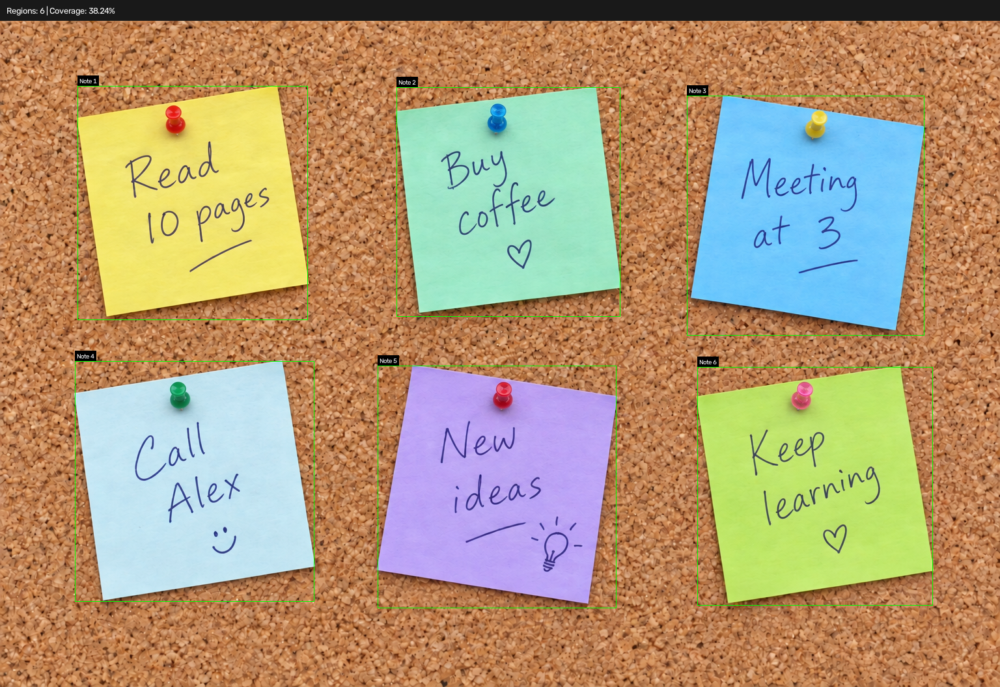
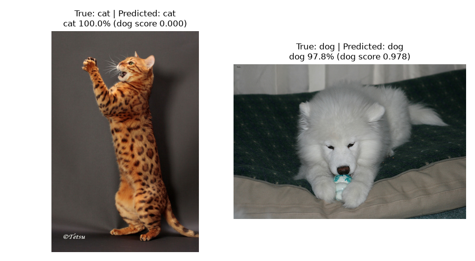

# Computer Vision Projects

Small projects built while learning computer vision.

## [Sticky Note Detector](sticky-note-detector/)

Detect and label sticky notes on a NumPy-generated board and a corkboard example using OpenCV.

## [Oxford Pets Classifier](oxford-pets-classifier/)

Classify cats and dogs in Oxford-IIIT Pet images with a PyTorch CNN trained from scratch. Reaches 91.0% balanced accuracy on the test split.

