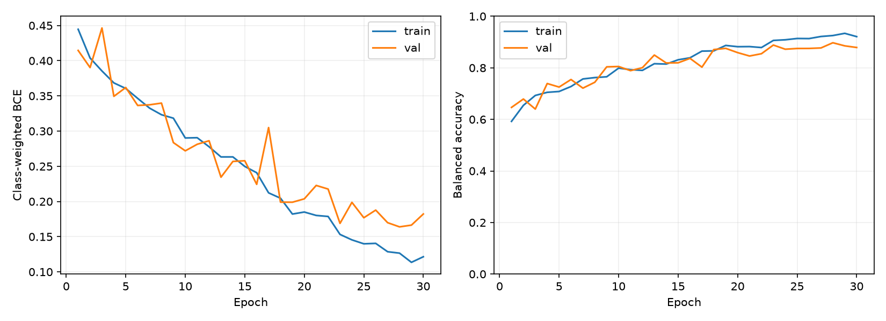

# Oxford Pets Classifier

A PyTorch CNN trained from scratch to tell cats from dogs in Oxford-IIIT Pet images.

## Sample predictions


| | Cat (Bengal) | Dog (Samoyed) |
|---|:---:|:---:|
| Prediction | cat ✅ | dog ✅ |
| Confidence | 99.99% cat | 97.80% dog |

Both images come from the test split.

## Results

30 epochs on Apple MPS. The best epoch (28) was picked by validation balanced accuracy.

| Metric | Validation | Test |
|---|---:|---:|
| Accuracy | 89.81% | 91.17% |
| Balanced accuracy | 89.73% | 90.96% |
| Cat recall | 89.50% | 90.36% |
| Dog recall | 89.96% | 91.55% |



## Usage

```bash
pip install -r requirements.txt
python main.py
```

Settings are in `config.py`.

## Model

```
[B, 3, 128, 128]
→ 4 × (Conv3x3 → BatchNorm → ReLU → MaxPool)   32 → 64 → 128 → 256 channels
→ AdaptiveAvgPool 4×4 → Flatten (4096)
→ Dropout → Linear 128 → ReLU → Dropout → Linear 1
→ logit [B]   (logit ≥ 0 → dog)
```

Training images get a random crop, horizontal flip and color jitter.

## Data

| Split | Cat | Dog | Total |
|---|---:|---:|---:|
| Train | 950 | 1994 | 2944 |
| Validation | 238 | 498 | 736 |
| Test | 1183 | 2486 | 3669 |

There are about twice as many dogs as cats, so the loss uses `pos_weight = cats / dogs` and the model is selected by
**balanced accuracy** (the mean of cat and dog recall) instead of plain accuracy.

## Source

[Oxford-IIIT Pet](https://www.robots.ox.ac.uk/~vgg/data/pets/), O. M. Parkhi, A. Vedaldi, A. Zisserman, C. V. Jawahar,
*Cats and Dogs*, IEEE CVPR, 2012.
