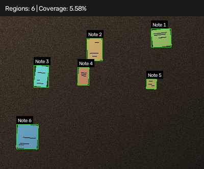

# Sticky Note Detector

A small OpenCV project that detects sticky notes on a NumPy-generated board and a corkboard example image.

## Results

### NumPy-generated board



### Corkboard example


## Setup and run

Use Python 3.12 and an environment inside this project:

```bash
cd sticky-note-detector
python3.12 -m venv .venv
source .venv/bin/activate
python -m pip install -r requirements.txt
python main.py
```

Skip the first command if you are already in the project folder. On Windows, activate with `.venv\Scripts\activate`.

## How it works

> [!NOTE]
> This project was built to practice the computer vision concepts I’m learning. It works best with separate notes on a fairly uniform background. Strong shadows, overlapping notes, or similar note and background colors can lead to missed or incorrect detections.

1. Apply a 9 × 9 Gaussian blur to reduce texture and soften text strokes.
2. Convert the image to Lab, a color space that separates lightness from two color channels.
3. Estimate the background color using the median of pixels along the image's four edges.
4. Calculate each pixel's distance from that background color and use Otsu's method to choose a threshold automatically.
5. Apply opening and closing with a 5 × 5 kernel to remove small protrusions and close small gaps.
6. Remove connected components smaller than 300 pixels and find their bounding boxes.
7. Draw numbered boxes and calculate the percentage of pixels marked as notes.

For the generated board, a reference mask allows us to calculate intersection over union (IoU). IoU compares the shared foreground pixels with all foreground pixels in either mask. A value of 1 means an exact match; two empty foregrounds also return 1.

The detector receives only the image, without the generator's note positions or reference mask. Both examples call `detect_notes(board)` with the same default parameters. The background estimate and Otsu threshold come from the pixels, so their numerical values can differ between images.

The generated scene contains rotated notes with short dark strokes on a noisy board with uneven lighting. Its smallest notes can fall below 400 foreground pixels after smoothing, so the area filter uses 300 pixels.

## Files

- `generator.py`: creates the board and reference mask.
- `detector.py`: produces the predicted mask and bounding boxes.
- `evaluation.py`: calculates coverage and IoU.
- `visualization.py`: draws boxes, labels, and a summary.
- `main.py`: runs both examples and saves the images.
- `requirements.txt`: records the dependency versions.
